# Family Vault

A free, private **digital locker** for your family's important papers and passwords — Aadhaar,
PAN, passports, bank details, property papers, logins — organised in folders and reachable from
any phone or computer.

It is built for **non-technical parents first**: big tap targets, plain words, a bottom tab bar on
phones, and the whole app in **English and Hindi (हिन्दी)**. One account can belong to several
families, and each family shares one vault.

- **Live app:** https://family-vault-3edo.onrender.com
- **Stack:** React 19 + Vite + Tailwind CSS 4 (client) · Node.js + Express + MongoDB (server)

---

## Screenshots

The screenshots use a made-up sample family; every name, number and card in them is fake.

<p align="center">
  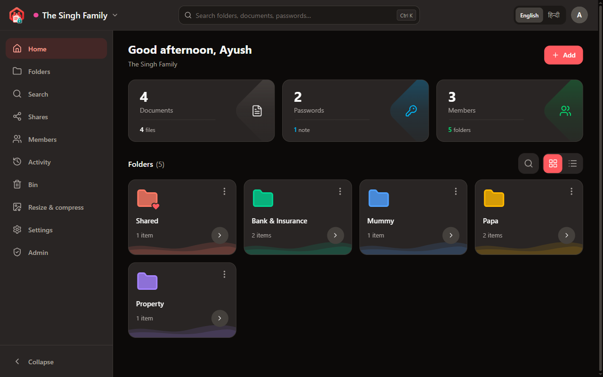
  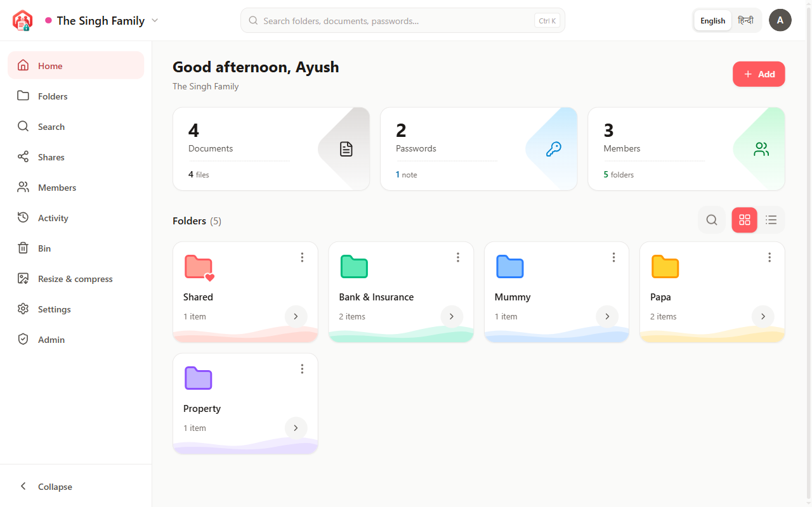
</p>
<p align="center"><em>Home, in the dark and the light theme.</em></p>

<p align="center">
  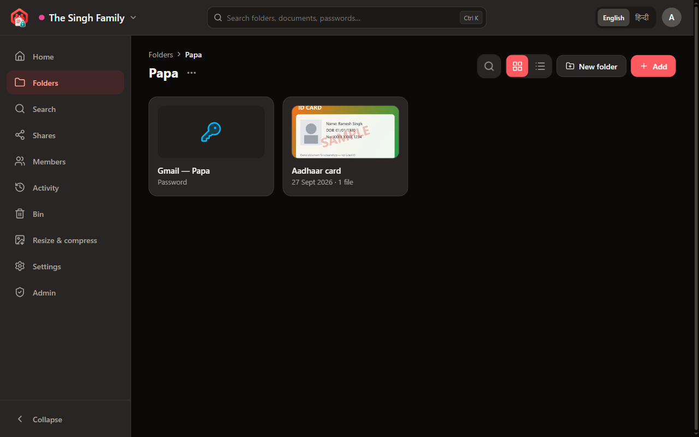
  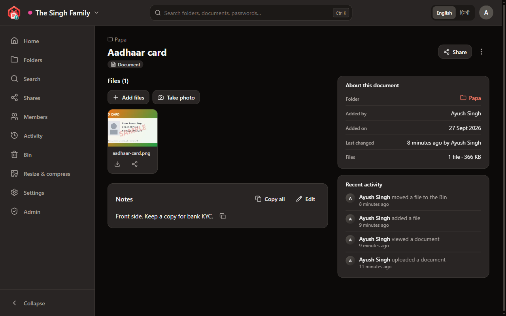
</p>
<p align="center"><em>A folder, and a document with its notes and history.</em></p>

<p align="center">
  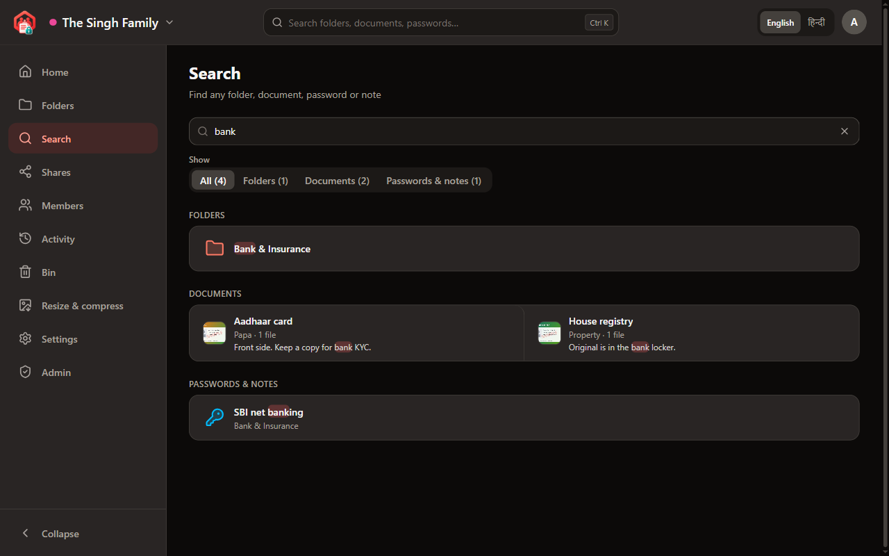
  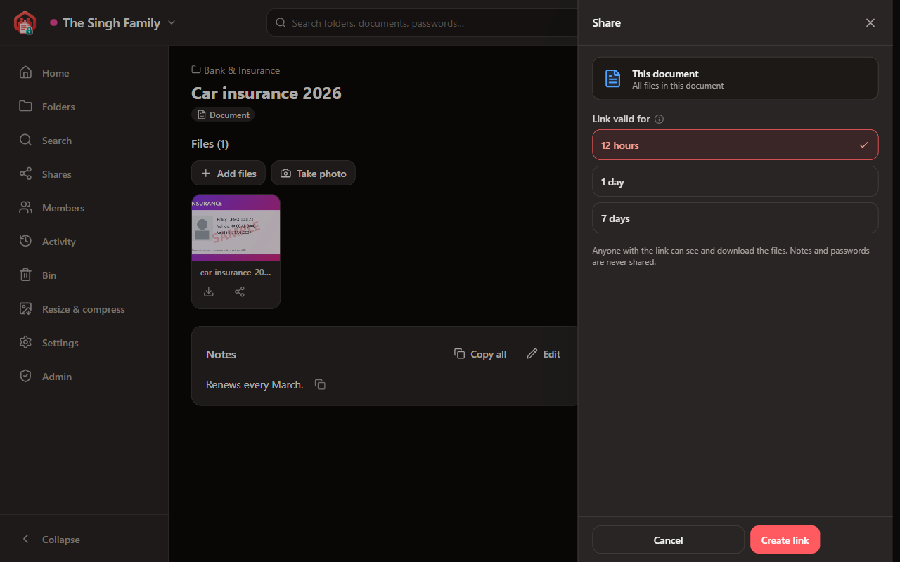
</p>
<p align="center"><em>Search across everything, and sharing with a link that expires.</em></p>

<p align="center">
  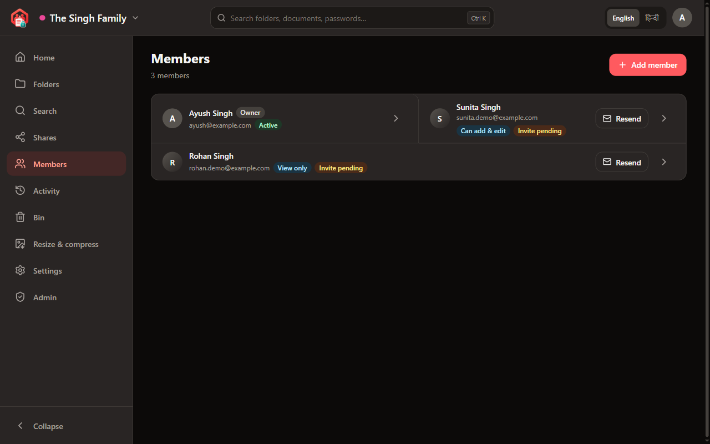
  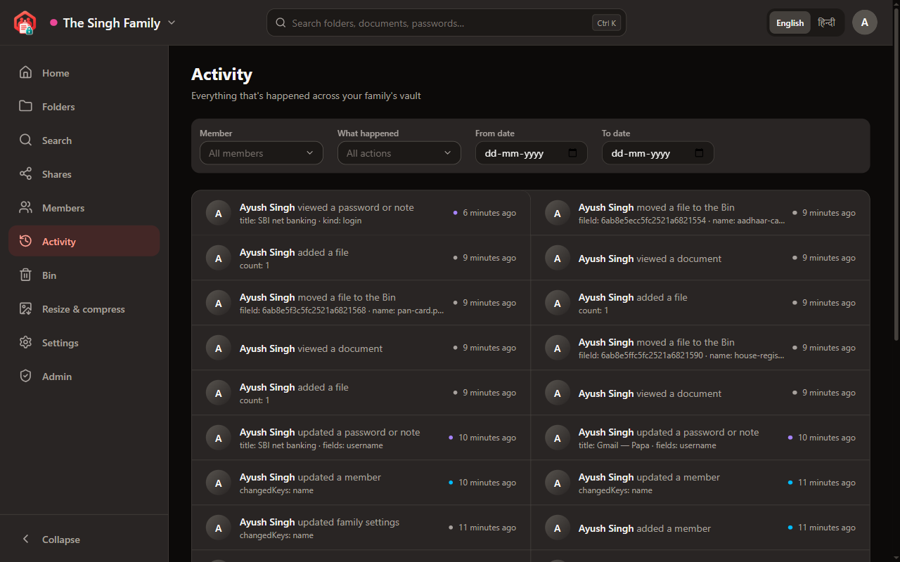
</p>
<p align="center"><em>Members and what they can do, and the activity log.</em></p>

<p align="center">
  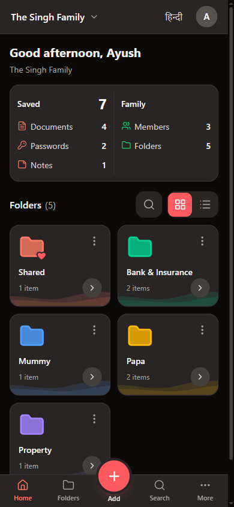
  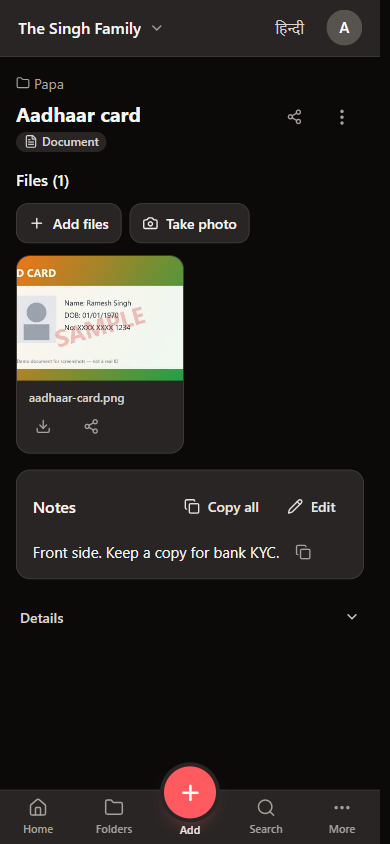
  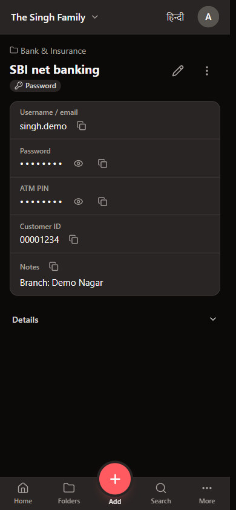
  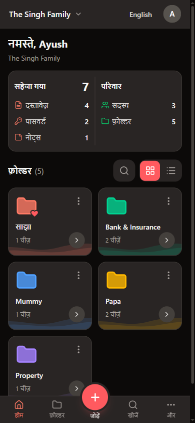
</p>
<p align="center"><em>On a phone: home, a document, a saved password, and the app in Hindi (हिन्दी).</em></p>

---

## Contents

- [Screenshots](#screenshots)
- [What it does](#what-it-does)
- [How it is built](#how-it-is-built)
- [Project layout](#project-layout)
- [Run it on your computer](#run-it-on-your-computer)
- [Environment variables](#environment-variables)
- [API reference](#api-reference)
- [Deploying (Render)](#deploying-render)
- [Google sign-in setup](#google-sign-in-setup)
- [Email (Gmail SMTP) setup](#email-gmail-smtp-setup)
- [Security and privacy](#security-and-privacy)
- [Roles and permissions](#roles-and-permissions)
- [Languages](#languages)
- [Tests](#tests)
- [More documentation](#more-documentation)
- [Troubleshooting](#troubleshooting)
- [Working on this repo](#working-on-this-repo)

---

## What it does

### For families

| Area | What you get |
| --- | --- |
| **Folders** | Every family starts with one **Shared** folder (साझा) that can't be renamed or deleted, plus its own folders (Papa, Mummy, …). Folders can nest, each gets its own colour automatically, and they show as a grid or a list. |
| **Documents** | A title, one or more files (photos or PDFs) and notes. Add files by upload, drag and drop, or the camera (phone camera or a PC webcam). Photos are **auto-cropped** to the paper's edges, with a manual crop editor. PDFs open right in the app, on phones too. |
| **Reading documents** | A scanner that runs **in the browser** reads Aadhaar, PAN, passport, driving licence, voter ID and bank passbook photos, fills in the title and writes the key details (name, number, dates) into notes. The text read from each file is kept with that file, can be searched, and each line can be copied. |
| **Passwords and notes** | Save a login (username, password, extra fields like a PIN or CVV) or a plain note. Fields named like PIN / password / OTP / CVV are hidden automatically ("Keep secret"). Empty username or password rows are not shown. |
| **Search** | One box that searches folder names, titles, notes, usernames, field names and the text read from files — never passwords or hidden fields. Results group into Folders / Documents / Passwords & notes, with counts. `Ctrl+K` focuses it on a computer. |
| **Sharing** | A **Share** button on folders, documents and single files makes a public link that expires after 12 hours, 1 day or 7 days (the family chooses the default). The public page shows only titles and files — never notes or passwords. Links can be turned off at any time from the Shares page. |
| **Members** | Invite family members by email (or copy the invite link when email is off). Each member can view only, or view and add; an admin can also make a member a **family admin** who can invite and manage people. Removing a member keeps everything they added. |
| **Bin** | Deleted folders, documents, files and passwords wait in the Bin and can be restored. |
| **Activity** | A log of who did what and when, with filters for member, action and dates. Member and action filters support **Include / Exclude** (tick several, or "all but these"). |
| **Account** | Profile and avatar colour, change password, language, light / dark theme, "log out everywhere" (takes effect instantly on all devices), and automatic sign-out after 60 minutes without use. |
| **Tools** | **Resize & compress**: shrink a photo or scan to a size limit for online forms (for example "under 100 KB"). |
| **Help on hover** | Short, simple tooltips (in English and Hindi) on buttons, tabs, cards and menu items. |

### For the people who run the app (admin panel, `/admin`)

- **Overview:** counts of people, pending invites, families, documents, passwords and active share links, the families using the most space, and recent activity.
- **Users** and **Families:** search, page through, open details, disable or re-enable an account, sign someone out of every device.
- **Activity:** every family's log, with Include / Exclude filters for family and action, and filters for email and dates.
- **Shares:** every share link across families, with page numbers and a status filter; turn a link off.
- **Admins:** add or remove admins (the super admin only).
- **Settings:** which sign-in methods are allowed, storage and upload limits, the Bin (permanently delete items), and email on/off with a "send test email" button.
- **System:** app version, database and memory details.

### Design

- **Mobile first.** Phones get a bottom tab bar and a slide-in menu; computers get a sidebar and wider two-column pages.
- One consistent UI kit (buttons, cards, tabs, dropdowns, filter bar, pagination, tooltips), ported from the Pabbly frontend starter pack and documented in [`docs/UI_KIT.md`](docs/UI_KIT.md).
- Installable to the home screen (web app manifest and icons).

---

## How it is built

```
Browser (phone / PC)
  └─ React app (client/)  ── HTTPS, JSON + multipart ──►  Express API (server/)  ──►  MongoDB
       · pages, UI kit, en/hi text                          · auth, families, files      · data
       · in-browser scanner (Tesseract, MRZ, QR/barcode)    · encryption, search         · files (GridFS)
       · auto-crop, resize & compress                       · emails, admin panel          or S3 / local disk
```

**Client (`client/`):** React 19, React Router 7, TanStack Query 5, React Hook Form + Zod,
Tailwind CSS 4, i18next (English / Hindi), lucide icons, react-hot-toast. The document scanner uses
`tesseract.js` (text), `mrz` (passport machine-readable zone), `zxing-wasm` (QR codes and barcodes)
and `exifr`; PDFs are shown with `pdfjs-dist`; cropping uses `react-easy-crop`.

**Server (`server/`):** Node.js 20+, Express 4, Mongoose 8. Security middleware: `helmet`,
`express-rate-limit`, `express-mongo-sanitize`, `hpp`, CORS locked to the client's address.
Uploads use `multer`, are checked by their real file type (`file-type`), resized with `sharp`
(plus a small preview image), then encrypted and stored. Email goes out through `nodemailer`.
Google sign-in uses `google-auth-library`. Folder downloads are zipped with `archiver`.

**Storage drivers** (`STORAGE_DRIVER`): `gridfs` (default — files live in the same MongoDB, no extra
service), `s3` (any S3-compatible bucket, e.g. Cloudflare R2), or `local` (local disk, for
development only).

---

## Project layout

```
.
├── client/                    React app
│   ├── public/                icons, logo, manifest, share-preview image
│   └── src/
│       ├── components/        layout (sidebar, tab bar, drawer) and ui/ (the UI kit)
│       ├── features/          activity, add, dashboard, documents, folders, items, members,
│       │                      resize, scan (the in-browser scanner), search, share
│       ├── pages/             one file per screen, plus admin/, auth/, items/, add/
│       ├── i18n/locales/      en/ and hi/ — one JSON file per area
│       ├── services/          API calls (axios)
│       ├── context/, hooks/, routes/, utils/, config/
│       └── main.jsx
├── server/
│   ├── src/
│   │   ├── modules/           one folder per API area: auth, family, members, folders,
│   │   │                      documents, files, items, shares, public, search, bin,
│   │   │                      activity, stats, me, platform, admin
│   │   ├── models/            Mongoose models (User, Family, Membership, Folder, Document,
│   │   │                      VaultItem, Share, Activity, PlatformSettings, …)
│   │   ├── middleware/        auth, validation, errors
│   │   ├── storage/           gridfs / s3 / local drivers
│   │   ├── services/          email, activity logging, alerts
│   │   ├── utils/             crypto (encryption), tokens, helpers
│   │   ├── seed/              dev helper (npm run seed)
│   │   ├── app.js             Express app (middleware + routes)
│   │   └── server.js          starts the server
│   └── tests/                 Vitest + Supertest, in-memory MongoDB
└── docs/                      API contracts, decisions log, UI kit guide
```

---

## Run it on your computer

### What you need

- **Node.js 20 or newer** and npm
- **MongoDB** — a local one (`mongodb://127.0.0.1:27017`) or a free MongoDB Atlas cluster

### 1. Install

```bash
git clone https://github.com/trex-ayush/family-vault.git
cd family-vault

cd server && npm install
cd ../client && npm install
```

### 2. Configure the server

```bash
cd server
cp .env.example .env
```

Fill in the empty secrets in `server/.env`:

```bash
# JWT_ACCESS_SECRET, JWT_REFRESH_SECRET, FILE_TOKEN_SECRET — run once for each:
node -e "console.log(require('crypto').randomBytes(48).toString('base64'))"

# FILE_ENCRYPTION_KEY, FIELD_ENCRYPTION_KEY — must be exactly 32 bytes; run once for each:
node -e "console.log(require('crypto').randomBytes(32).toString('base64'))"
```

Set `MONGODB_URI` to your database. Everything else in `.env.example` has a working default for
local use. Email and Google sign-in are optional (see their sections below).

> **Keep the two encryption keys safe.** Files and hidden text are encrypted with
> `FILE_ENCRYPTION_KEY` and `FIELD_ENCRYPTION_KEY`. If they are lost or changed, what was saved
> with them can no longer be opened. Back them up somewhere safe, outside the server.

### 3. Configure the client

```bash
cd ../client
cp .env.example .env
```

`VITE_API_URL=http://localhost:5000/api` already points at the local server.

### 4. Start both

Two terminals:

```bash
# terminal 1
cd server
npm run dev        # API on http://localhost:5000 (restarts on changes)

# terminal 2
cd client
npm run dev        # app on http://localhost:5173
```

Open http://localhost:5173, sign up, and create your family. To use the admin panel locally, put
your email in `SUPER_ADMIN_EMAIL` in `server/.env` and restart the server.

### Scripts

| Where | Command | What it does |
| --- | --- | --- |
| server | `npm run dev` | start the API with auto-restart (nodemon) |
| server | `npm start` | start the API (production) |
| server | `npm test` | run the server tests once |
| server | `npm run test:watch` | run the server tests on every change |
| server | `npm run seed` | make sure every family in the database has its Shared folder (safe to re-run) |
| client | `npm run dev` | start the app with hot reload |
| client | `npm run build` | build the app into `client/dist` |
| client | `npm run preview` | serve the built app locally |
| client | `npm test` | run the client tests once |

---

## Environment variables

### Server (`server/.env`)

| Variable | Required | Default | Purpose |
| --- | --- | --- | --- |
| `NODE_ENV` | | `development` | `production` on the live server |
| `PORT` | | `5000` | port the API listens on |
| `MONGODB_URI` | **yes** | | MongoDB connection string |
| `CLIENT_URL` | **yes** | `http://localhost:5173` | the app's public address — used for CORS and for links in emails (invites, password reset, share links, logo) |
| `JWT_ACCESS_SECRET` | **yes** | | signs short-lived access tokens |
| `JWT_REFRESH_SECRET` | **yes** | | must be set (checked at start-up), but not used at the moment — refresh tokens are random values stored as hashes |
| `FILE_TOKEN_SECRET` | **yes** | | signs short-lived file view / download links |
| `FILE_ENCRYPTION_KEY` | **yes** | | 32-byte base64 master key for file encryption |
| `FIELD_ENCRYPTION_KEY` | **yes** | | 32-byte base64 key for passwords, notes and other hidden text |
| `STORAGE_DRIVER` | | `gridfs` | `gridfs`, `s3` or `local` |
| `S3_ENDPOINT`, `S3_BUCKET`, `S3_ACCESS_KEY_ID`, `S3_SECRET_ACCESS_KEY`, `S3_REGION` | only for `s3` | `S3_REGION=auto` | S3-compatible bucket (e.g. Cloudflare R2) |
| `MAX_FILE_MB` | | `20` | largest file that can be uploaded |
| `ACTIVITY_RETENTION_DAYS` | | `365` | starting value for how long activity is kept (admins can change it in Admin → Settings) |
| `STORAGE_LIMIT_MB` | | `512` | family storage size used for the 80% / 95% warning emails |
| `GOOGLE_CLIENT_ID` | | | turns on Google sign-in (blank = off) |
| `SMTP_HOST`, `SMTP_PORT`, `SMTP_SECURE`, `SMTP_USER`, `SMTP_PASS`, `MAIL_FROM` | | Gmail defaults | outgoing email (blank `SMTP_HOST` = off) |
| `SUPER_ADMIN_EMAIL` | | | the one super admin of `/admin`; never stored in the database, so it can't be removed from inside the app |
| `PLATFORM_OWNER_EMAIL` | | | older name for the same role; used when `SUPER_ADMIN_EMAIL` is blank |

### Client (`client/.env`)

| Variable | Required | Purpose |
| --- | --- | --- |
| `VITE_API_URL` | **yes** | the API's address, ending in `/api` |
| `VITE_GOOGLE_CLIENT_ID` | | shows the Google button; must match the server's `GOOGLE_CLIENT_ID` |
| `VITE_SITE_URL` | | the app's public address, used for the link-preview picture. When blank, the build uses `https://family-vault-3edo.onrender.com` |

Client variables are baked in at **build time** — rebuild the client after changing them.

---

## API reference

The server is a JSON API under `/api`. This section is a quick map of it. **The full details of
every endpoint** — who can call it, parameters, body fields, an example response and the
errors — are in **[docs/API_REFERENCE.md](docs/API_REFERENCE.md)**.

**Quick facts**

- **Base URL:** `http://localhost:5000/api` locally; in production, the API service's address + `/api`.
- **Sign in:** `POST /auth/login` returns an `accessToken` (15 minutes) and a `refreshToken`.
  Send `Authorization: Bearer <accessToken>`; renew with `POST /auth/refresh`.
- **Pick the family:** routes that work on one family's data also need `X-Family-Id: <familyId>`.
- **Errors** always look like `{ "message": "…", "code": "SOME_CODE" }`, with a matching HTTP status.
- **Uploads** use `multipart/form-data`; everything else is JSON.

**All 86 endpoints at a glance** — click an area for its details.

#### [Health](docs/API_REFERENCE.md#health)

| Method | Path | What it does |
| --- | --- | --- |
| `GET` | `/health` | Check that the server is up (no `/api` prefix) |
| `GET` | `/api/health` | Check that the server is up (Render's health-check path) |

#### [Auth](docs/API_REFERENCE.md#auth)

| Method | Path | What it does |
| --- | --- | --- |
| `POST` | `/auth/signup` | Create an account with email and password |
| `POST` | `/auth/login` | Sign in with email and password |
| `POST` | `/auth/refresh` | Swap a refresh token for a new token pair |
| `POST` | `/auth/logout` | Sign out this session |
| `POST` | `/auth/logout-all` | Sign out on every device |
| `GET` | `/auth/me` | Get your account and every family you belong to |
| `PATCH` | `/auth/me` | Update your name, colour or language |
| `POST` | `/auth/change-password` | Change your password |
| `POST` | `/auth/google` | Sign in, or start signing up, with Google |
| `POST` | `/auth/google/complete` | Finish a new Google signup |
| `POST` | `/auth/set-password` | Add a first password to a Google-only account |
| `POST` | `/auth/forgot-password` | Email a password reset link |
| `POST` | `/auth/reset-password` | Set a new password from an emailed reset link |
| `GET` | `/auth/accept-invite/:token` | Look up an invite link before accepting it |
| `POST` | `/auth/accept-invite` | Accept an invite by setting a password |

#### [Notification settings](docs/API_REFERENCE.md#notification-settings)

| Method | Path | What it does |
| --- | --- | --- |
| `GET` | `/me/notification-prefs` | Get your alert email settings |
| `PATCH` | `/me/notification-prefs` | Turn alert emails on or off |

#### [Family](docs/API_REFERENCE.md#family)

| Method | Path | What it does |
| --- | --- | --- |
| `POST` | `/family` | Create a new family |
| `GET` | `/family` | Get the selected family's details |
| `PATCH` | `/family` | Rename the family or change the default share-link length |
| `POST` | `/family/test-email` | Send yourself a test email |

#### [Members](docs/API_REFERENCE.md#members)

| Method | Path | What it does |
| --- | --- | --- |
| `GET` | `/members` | List everyone in the family |
| `POST` | `/members` | Invite a person to the family |
| `POST` | `/members/:id/invite-link` | Get a fresh invite link for a pending invite |
| `POST` | `/members/:id/resend-invite` | Email a fresh invite link |
| `PATCH` | `/members/:id` | Change a member's name, role, access or status |
| `POST` | `/members/:id/reset-password` | Set a new password for a member |
| `DELETE` | `/members/:id` | Remove a member from the family |

#### [Folders](docs/API_REFERENCE.md#folders)

| Method | Path | What it does |
| --- | --- | --- |
| `GET` | `/folders/tree` | List every folder in the family |
| `GET` | `/folders/browse` | Open one folder level |
| `POST` | `/folders` | Create a folder |
| `PATCH` | `/folders/:id` | Rename or move a folder |
| `DELETE` | `/folders/:id` | Move a folder and everything inside it to the Bin |
| `POST` | `/folders/:id/zip-link` | Get a link to download a folder as a ZIP |

#### [Documents](docs/API_REFERENCE.md#documents)

| Method | Path | What it does |
| --- | --- | --- |
| `GET` | `/documents` | List documents, newest first |
| `GET` | `/documents/:id` | Get one document with its files |
| `POST` | `/documents` | Upload a new document |
| `PATCH` | `/documents/:id` | Change a document's title or notes, or move it |
| `DELETE` | `/documents/:id` | Move a document to the Bin |
| `POST` | `/documents/:id/files` | Add more files to a document |
| `DELETE` | `/documents/:id/files/:fileId` | Move one file to the Bin |
| `PATCH` | `/documents/:id/files/:fileId/text` | Save the text read from one file |
| `POST` | `/documents/:id/zip-link` | Get a link to download a document's files as a ZIP |
| `GET` | `/documents/:id/activity` | List what happened to one document |

#### [Files](docs/API_REFERENCE.md#files)

| Method | Path | What it does |
| --- | --- | --- |
| `GET` | `/files/:signedToken` | Open or download one file or thumbnail |
| `GET` | `/files/zip/:token` | Download a folder or document as a ZIP |

#### [Passwords and notes](docs/API_REFERENCE.md#passwords-and-notes)

| Method | Path | What it does |
| --- | --- | --- |
| `GET` | `/items` | List passwords and notes |
| `GET` | `/items/:id` | Get one password or note in full |
| `POST` | `/items` | Create a password or note |
| `PATCH` | `/items/:id` | Change a password or note |
| `DELETE` | `/items/:id` | Move a password or note to the Bin |
| `GET` | `/items/:id/activity` | List the activity for one item |

#### [Search](docs/API_REFERENCE.md#search)

| Method | Path | What it does |
| --- | --- | --- |
| `GET` | `/search` | Search folders, documents and items |

#### [Share links](docs/API_REFERENCE.md#share-links)

| Method | Path | What it does |
| --- | --- | --- |
| `GET` | `/shares` | List the family's share links |
| `POST` | `/shares` | Create a share link |
| `PATCH` | `/shares/:id` | Revoke or extend a share link |
| `DELETE` | `/shares/:id` | Remove a share link |
| `GET` | `/shares/:id/access-log` | See when a share link was opened or downloaded |

#### [Public share pages](docs/API_REFERENCE.md#public-share-pages)

| Method | Path | What it does |
| --- | --- | --- |
| `GET` | `/public/shares/:token` | Open a share link |
| `POST` | `/public/shares/:token/zip-link` | Download everything in a share link as a ZIP |

#### [Bin](docs/API_REFERENCE.md#bin)

| Method | Path | What it does |
| --- | --- | --- |
| `GET` | `/bin` | List everything in the family's Bin |
| `POST` | `/bin/:type/:id/restore` | Restore one entry from the Bin |

#### [Activity](docs/API_REFERENCE.md#activity)

| Method | Path | What it does |
| --- | --- | --- |
| `GET` | `/activity` | List the family's activity log |

#### [Stats](docs/API_REFERENCE.md#stats)

| Method | Path | What it does |
| --- | --- | --- |
| `GET` | `/stats` | Get the Home screen counts |

#### [Platform settings](docs/API_REFERENCE.md#platform-settings)

| Method | Path | What it does |
| --- | --- | --- |
| `GET` | `/platform-settings` | Read the platform settings |
| `PATCH` | `/platform-settings` | Change the platform settings |
| `GET` | `/platform-settings/bin` | List the Bin across every family |
| `POST` | `/platform-settings/bin/purge` | Permanently delete entries from the Bin |
| `POST` | `/platform-settings/test-email` | Send a test email to yourself |

#### [Admin panel](docs/API_REFERENCE.md#admin-panel)

| Method | Path | What it does |
| --- | --- | --- |
| `GET` | `/admin/me` | Get your admin role |
| `GET` | `/admin/overview` | Get app-wide totals and recent activity |
| `GET` | `/admin/users` | List accounts |
| `GET` | `/admin/users/:id` | Get one account |
| `PATCH` | `/admin/users/:id` | Disable or enable an account |
| `POST` | `/admin/users/:id/logout-all` | Sign an account out everywhere |
| `GET` | `/admin/families` | List families |
| `GET` | `/admin/families/:id` | Get one family with its members |
| `GET` | `/admin/activity` | List activity across every family |
| `GET` | `/admin/shares` | List share links across families |
| `POST` | `/admin/shares/:id/revoke` | Turn off any share link |
| `GET` | `/admin/admins` | List the super admin and every admin |
| `POST` | `/admin/admins` | Add an admin |
| `DELETE` | `/admin/admins/:id` | Remove an admin |
| `GET` | `/admin/system` | Get server and database health details |

## Deploying (Render)

The live app runs on [Render](https://render.com) as two services from this repository, with a
MongoDB Atlas database.

### 1. API — Render **Web Service**

| Setting | Value |
| --- | --- |
| Root directory | `server` |
| Build command | `npm install` |
| Start command | `npm start` |
| Health check path | `/api/health` |
| Environment | every server variable above, with `NODE_ENV=production` and `CLIENT_URL` set to the app's public address |

### 2. App — Render **Static Site**

| Setting | Value |
| --- | --- |
| Root directory | `client` |
| Build command | `npm install && npm run build` |
| Publish directory | `dist` |
| Rewrite rule | `/*` → `/index.html` (so links like `/browse/…` or `/s/<token>` open the app) |
| Environment | `VITE_API_URL` (the API service's address + `/api`), and optionally `VITE_GOOGLE_CLIENT_ID`, `VITE_SITE_URL` |

Pushing to `main` redeploys both services automatically.

**Free plan note:** a free Render web service goes to sleep when unused, so the first request after a
quiet spell can take up to a minute. The app shows a friendly "waking up" screen while that happens.

---

## Google sign-in setup

Family Vault supports signing in with Google (Google Identity Services' ID-token flow — no OAuth
redirect, no client secret). It's entirely optional: leave the variables below blank and the
feature is off end to end (the client hides the Google button; the server's `/auth/google*`
endpoints respond `501`). Admins can also switch sign-in methods on or off in Admin → Settings.

1. Go to [Google Cloud Console](https://console.cloud.google.com/) and create a project (or pick
   an existing one).
2. Under **APIs & Services → OAuth consent screen**, configure it: choose **External**, set an
   app name, and provide a support email.
3. Under **APIs & Services → Credentials**, click **Create credentials → OAuth client ID**, and
   choose **Web application**.
4. Under **Authorized JavaScript origins**, add:
   - `http://localhost:5173` (local development)
   - your app's public address, e.g. `https://family-vault-3edo.onrender.com`
5. Copy the generated **Client ID** into:
   - `GOOGLE_CLIENT_ID` on the server
   - `VITE_GOOGLE_CLIENT_ID` on the client (then rebuild the client)

No client secret is needed — the server only verifies the ID token Google's library hands back
(`OAuth2Client.verifyIdToken`); it never performs a server-side OAuth exchange.

---

## Email (Gmail SMTP) setup

Every email goes out in the **recipient's own app language** (English or Hindi); an invite uses the
inviter's language. Emails never contain passwords, hidden fields or file contents — they link back
into the app instead.

| Email | Goes to | What it says |
| --- | --- | --- |
| Password reset | the person | a one-time link to choose a new password, and how long it works |
| Password changed | the person | when it was changed (after a reset *or* a change in Settings), that every device was signed out, and a link to reset it if it wasn't them |
| Invite | the invited email | who invited them, to which family, what they'll be able to do (view only / view and add), until when the invite works |
| Invite accepted | family admins | who joined (name and email) |
| Member added / removed / access turned off | family admins | who did it, to whom, and what it means (e.g. "everything they added stays") |
| Access changed | family admins | who changed it, and the new access in plain words — including being made (or no longer) a family admin |
| Items deleted | family admins | who deleted what (one email for a batch), and that it can be restored from the Bin |
| New device sign-in | family admins | whose account, device, system, browser, IP address and time (Indian time) |
| Repeated failed sign-ins | family admins | which account (name and email), how many tries, when, and what to do |
| Storage warning (80% / 95%) | app admins | which family, how much it uses, and where to change the warning size |
| Test email | whoever pressed "Send test email" | that email is working |

A family admin can switch each alert type on or off in Settings → Family → Notifications. There is
no digest email — Home and the Activity log show recent activity on demand.

Email is optional. With `SMTP_HOST` blank it is off: in development the server prints the email's
subject and link to the console instead of sending it, so invites and password resets still work
locally. Admins can also turn email on or off in Admin → Settings and send a test email from there.
When email is off, the invite screen shows the invite link so it can be sent another way.

1. Turn on **2-Step Verification** on the Gmail account you want to send from
   (https://myaccount.google.com/security).
2. Go to https://myaccount.google.com/apppasswords and create an app password named
   "Family Vault" (16 characters, no spaces).
3. Set these on the server (Render) and in your local `server/.env`:
   - `SMTP_USER` — the Gmail address
   - `MAIL_FROM` — e.g. `"Family Vault <that-same-address@gmail.com>"`
   - `SMTP_PASS` — the 16-character app password from step 2 (never the normal account password)
   - `SMTP_HOST` / `SMTP_PORT` / `SMTP_SECURE` already default to `smtp.gmail.com` / `465` / `true`
     — only change them for a different email provider.

Gmail's free sending limit is roughly **500 emails a day** per account. Recipients see your Gmail
address as the sender.

---

## Security and privacy

### What is encrypted

Stored with **AES-256-GCM**:

- **Every file** (photos and PDFs) and its preview image. Each file gets its own random key, which
  is itself encrypted with `FILE_ENCRYPTION_KEY` ("envelope encryption").
- **Document notes** and the **text read from each file**.
- **Passwords and notes:** username, password, the values of extra fields, and notes.

### What is not encrypted

Stored as plain text so the app can list, sort and search them: titles of documents and passwords,
folder names, file names, the *names* of extra fields (e.g. "PIN", not the PIN itself), family and
member names and emails, the activity log, and share-link details (expiry, open count).

### Keys

The encryption keys live on the server, so the server can decrypt the data to show it to signed-in
family members. A copy of the database on its own shows only scrambled files, passwords and notes —
but whoever runs the server can, in principle, read them. This is **encryption at rest**, not
end-to-end encryption.

### Other protections

- Passwords are stored only as one-way hashes (`bcryptjs`).
- Short-lived access tokens (JWT) plus a random refresh token that the server stores only as a
  hash and replaces on every use. "Log out everywhere" stamps the account, so every older token
  stops working at once.
- Automatic sign-out after 60 minutes without real use (shared across open tabs).
- Rate limits on sign-in, public share pages and the whole API; `helmet` security headers;
  protection against MongoDB operator injection and duplicate query parameters.
- Uploads are checked by their real content, not just the file name. Allowed: JPEG, PNG, WebP,
  HEIC/HEIF and PDF, up to `MAX_FILE_MB`.
- Files are only served through short-lived signed links.
- Every request is limited to the caller's own family; tests check that one family can never see
  another's data.
- Public share pages never show notes, passwords or note items.

---

## Roles and permissions

**Inside a family**

| Role | Can do |
| --- | --- |
| Member — view only | see and search everything, download files |
| Member — view and add | also add, edit, move, share and delete, and see the Activity log |
| Family admin | also invite, remove and change members, and change family settings (share-link default, alerts) |

The person who creates a family is its owner and first admin. A family always keeps at least one
admin.

**Across the whole app**

| Role | Can do |
| --- | --- |
| Admin | use the admin panel: users, families, activity, share links, settings, the Bin list |
| Super admin (`SUPER_ADMIN_EMAIL`) | everything an admin can, plus add or remove admins and permanently delete items from the Bin |

---

## Languages

The whole interface is in **English** and **Hindi**. The language switch sits in the top bar, and
the choice is saved to the account, so it follows the person to every device. Text lives in
`client/src/i18n/locales/en/` and `client/src/i18n/locales/hi/`, one JSON file per area (`common`,
`dashboard`, `documents`, `admin`, …). When adding text, add both the English and the Hindi entry,
in simple everyday words.

---

## Tests

```bash
cd server && npm test     # API tests: Vitest + Supertest on an in-memory MongoDB
cd client && npm test     # client tests: Vitest
```

- The server tests start their own in-memory MongoDB (`mongodb-memory-server`) — they never touch
  a real database and don't need a `.env` file.
- The server tests cover sign-in and sessions, families and members, folders, documents and files,
  passwords, search, sharing, the Bin, activity, platform settings and the admin panel, including
  tenant isolation and "no secrets in responses" checks.
- The client tests cover the scanner's parsers, date handling, the filter and pagination helpers,
  and a check that every component used on a page is actually imported.

---

## More documentation

| File | What's inside |
| --- | --- |
| [`docs/API_REFERENCE.md`](docs/API_REFERENCE.md) | every API endpoint, with parameters, body fields, example responses and errors |
| [`docs/API.md`](docs/API.md) | longer notes on the family-facing API |
| [`docs/ADMIN_API.md`](docs/ADMIN_API.md) | longer notes on the admin panel API |
| [`docs/ITEMS.md`](docs/ITEMS.md) | passwords and notes (vault items) |
| [`docs/DECISIONS.md`](docs/DECISIONS.md) | why things are the way they are — read this before changing behaviour |
| [`docs/UI_KIT.md`](docs/UI_KIT.md) | the UI components, design tokens and writing style (including tooltips) |

---

## Troubleshooting

| Problem | Fix |
| --- | --- |
| `EADDRINUSE: address already in use :::5000` | an older copy of the server is still running. Stop it (or restart your terminal), then type `rs` in the nodemon window. |
| The server stops at start-up about a missing variable | a required variable in `server/.env` is empty — compare it with `.env.example`. |
| `FILE_ENCRYPTION_KEY` / `FIELD_ENCRYPTION_KEY` rejected | each must be base64 of exactly 32 bytes — generate them with the command in [Configure the server](#2-configure-the-server). |
| Files or passwords show as empty after a move to a new server | the encryption keys differ from the ones used to save them. Put the original keys back. |
| The app can't reach the API (CORS error) | `CLIENT_URL` on the server must exactly match the address the app is opened from. |
| The Google button doesn't appear | set `VITE_GOOGLE_CLIENT_ID` and rebuild the client; add the app's address to the Google client's JavaScript origins. |
| Emails don't arrive | check the `SMTP_*` values, that `SMTP_PASS` is a Gmail *app password*, and use Admin → Settings → Send test email. |
| The first load on the live site is slow | the free Render service was asleep; it wakes within about a minute. |
| "Something went wrong" on a page | a render error on that page. Open the browser console for the exact message; in development the app also shows it. |

---

## Working on this repo

- **Commit messages** follow the format in `CLAUDE.md`: a type prefix (`feat:`, `fix:`, `style:`,
  `refactor:`, `docs:`, `test:`, `chore:`, `perf:`), a short heading, then 2–5 bullets describing
  what changed for the user. A `commit-msg` git hook enforces it — don't bypass it with
  `--no-verify`.
- **Mobile first:** check every screen at phone width (about 390 px) before a computer.
- **Both languages:** every new piece of text needs an English and a Hindi entry.
- **Never run tests or experiments against the live database.** Use the in-memory database the
  tests start, or a local MongoDB.
- Never commit `.env` files, keys or passwords.
